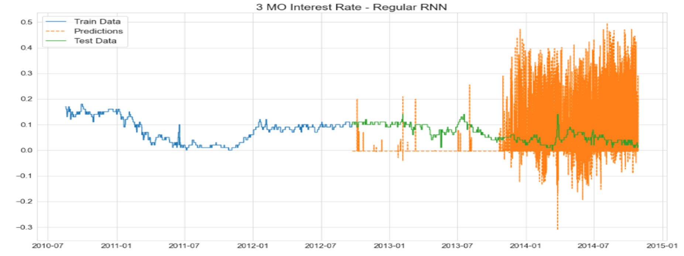

# U.S. Treasury Primary Market Transactions & Interest Rate Predictions
### Capstone Project Developed for General Assembly - Data Science Immersive Program
---

# Question for Analysis:
---
Can a Machine Learning model adequately anticipate future interest rates? Can such a model make reasonably accurate predictions when it is trained on past Yield Curve data that is combined with transaction data of the Monetary Policy that aims to steer interest rates in a particular direction?

# Project Background, Summary & Scope of Analysis:
---
This project explores transaction data from the Monetary Policy known as ["Quantitative Easing"](https://en.wikipedia.org/wiki/Quantitative_easing#After_2007) (QE). The time period of the data spans mid 2010 to near year-end 2014. This time period was one of [significant monetary expansion](https://www.newyorkfed.org/markets/programs-archive/large-scale-asset-purchases) from the Federal Reserve (Fed) through direct purchases of U.S. Treasuries and other instruments. This endeavor was to lower interest rates at different maturity points on the yield curve. This policy was implemented day to day through open market transactions conducted by the New York branch of the Federal Reserve (NYFed).

The data for exploration and analysis is the transaction data of U.S. Treasuries purchased and sold by the NYFed with [Primary Dealer](https://en.wikipedia.org/wiki/Primary_dealer) counterparties. Primary Dealers are the commercial banks authorized and obligated to participate in these exchanges with the NYFed. The exploration and analysis also utilized the Treasury Yield Curve data for Yield Curve observations at the same points in time as the transactions. The Yield Curve data was retreived from [Quandl API](https://docs.quandl.com). 

These two datasets were joined together for analysis and modeling. Exploration was conducted to identify patrterns in the transactions of Treasuries be specific Primary Dealer counterparties. For modeling, three neural nets with different architectures were used as well as a Vector AutoRegressive (VAR) Model. The targets selected were the 3 month and the 30 year interest rates. These targets are continuous and the type of Machine Learning these models were fit for was therefore regression. Predictions for each model were evaluated and compared visually on a time series plot, as by Mean Squared Error (MSE) and Mean Absolute Percentage Error (MAPE). The models were also compared in two groups by their performance on the two different targets.

# Directory & File Structure:
---
* README.md - Description of Project procedure and analysyis
* code: Three sequential noteboooks for processing, EDA and modeling
    * Please run notebooks in the numerical order of their labels
    - 01_processing_script.ipynb
    - 02_EDA.ipynb
    - 03_final_model_script

* data: - Two directories:
    - **csv_exports** - Results of data pre-processing for purposes of EDA and modeling
    - **Treasuries** - Native Excel files that constitute original data that was analyzed. Each file groups transaction records by quarter. These files were retrieved from The New York Federal Reserve website page for [historical transaction data](https://www.newyorkfed.org/markets/OMO_transaction_data.html)

* documentation: Presentation slides and Python environment requirements

* images: Collection of third party and project generated png files for visualization

# Data Dictionary
- The following describes all features used for analysis after preprocessing prior to the encoding of the feature "Counterparty."
- Other features native to the original data that were dropped are not included.
- These feature are clearly presented in the edaFINAL.csv found in the data directory.

|Feature|Type|Description|
|---|---|---|
|Trade date|Pandas Datetime|Date of transaction. Native Data displayed many transactions occuring on the same day with no further time division. Equal and unique time intervals were interpolated from this feature and used as the index for analysis and modeling.|
|Settlement date|Pandas Datetime|One day ahead of Trade date at each index|
|Transaction category|object|Binary, purchase or sale. Encoded for modeling|
|Trade amount (in millions, USD)|integer|Amount agreed to be paid at each transaction|
|Security description|object|Full description of terms of Treasury purchased, including maturity date, type and coupon|
|CUSIP|object|Unique identifier for any security. Not used for analysis but could have value for further exploration.|
|Price|float|Price at purchase for Treasury.|
|Total amount transferred (in millions, USD)|float|Actual amount paid for Treasuries at time of purchase|
|Counterparty|object|Name of Primary Dealer buying or selling Treasuries to New York Federal Reserve branch.|
|Type|object|Engineered from Security description. Four types of Bill, Note, Bond or Inflation Indexed|
|Coupon|float|Actual interest rate for specific treasuries purchased.|
|Term|Pandas Datetime|Engineered from Scurity description: Same as maturity date.|
|1 MO|float|Interest rate for maturity at length of label at the indexed time. Joined on transaction data after retreived from Quandl API call. Interest rate is displayed as a whole number percentage.|
|3 MO|float|Same description as previous interest rate feature. Served as a target for one sequence of modeling.|
|1 YR|float|Same description as previous interest rate feature.|
|2 YR|float|Same description as previous interest rate feature.|
|5 YR|float|Same description as previous interest rate feature.|
|7 YR|float|Same description as previous interest rate feature.|
|10 YR|float|Same description as previous interest rate feature.|
|20 YR|float|Same description as previous interest rate feature.|
|30 YR|float|Same description as previous interest rate feature. Served as a target for one sequence of modeling.|
|Time to Maturity (Years)|Timedelta|Engineered: Time difference between Term and Trade date in years.|

# Data Pre-Processing:
---
The native Excel files were manually downloaded from the NYFed web page. Once these files were organized in a directory, a new pandas DataFrame was created to chronologically concatenate their quarterly data. Stanard cleaning was applied to features. Interest rate Yield Curve data was retreived from a Quandl API call and concatenated with the transaction DataFrame. New features were engineered from the Security description column. Columns with date values were converted to Pandas datetime objects. The index was changed to the datetime index from the "Trade date" column. The shape of the dataset amounted to 89,908 rows and 28 columns (before categorical encoding).

An initial challenge was that many rows of transactions were indexed on the same day with no further time division information to distinguish them. This created many duplicate values for the datetime columns and the index. The solution to this problem was found by interpolating equal intervals of time for each row. Trial and error found the time interval that kept every original rown in the correct chronolgical order, around 27 minutes. Interpolating was performed using [traces](https://traces.readthedocs.io/en/latest/), a third party Python library.

One DataFrame, exclusively for Exploratory Data Analysis, was exported as a csv file. Processong after this was in preparation for modeling and involved One Hot Encoding of categorical features. The features that were encoded were "Transaction category," "Type," and "Counterparty." The DataFrame for modeling was separately exported as a csv file as well.

# Exploratory Data Analysis:
---
The different Primary Dealers (counterparties) were the focus of the data exploration. Specific attention was paid to the counterparties that participated in the most transactions with the NYFed during the time period of the dataset. 

Top 10 most active counterparties by number of transactions

Scatterplots were produced to measure the Time to Marurity and Coupon rates on the treasuries that were selected for purchase by the NYFed during QE.

In this example, the NYFed is concentrating its purchases at three maturity ranges. What is notable is the high coupon for the cluster of Treasury purchases in the middle. We might be able to infer that te Fed was aiming to lower the high rates quoted on those Treasuries at that time.

The basic pattern of interest rate changes over time was explored. Below are the Time series charts of the two targets:

3 month interest rate

30 year interest rate

Interesting patterns were uncovered using a rolling average of 1500 rows to measure average time to marurity of Treasuries being sold to the NYFed by the top 5 counterparties:

# Modeling & Predictions:
---
This section will summarize the results of three Neural Nets and an OLS based VAR model.

OLS Time Series regression methods were not adequate for developing a model that could predict future interest rates with reasonable accuracy. The VAR model made predictions with significant errors and, expectedly, predicted only the mean of the target for a forecasting period of any reasonable length. The Neural Nets performed better but with an important note. The Neural Nets struggled to make adequate predictions on interest rates of *shorter* maturiries (1 month, 3 month, etc.). 

The Neural Nets were much better at anticipating future interest rates with *longer* maturities. The 3 month and 30 year rates were selected as targets to illustrate this comparison. The reasons why the Neural Nets did not struggle as much when predicting longer dated rates is a good point of departure for further analysis. Regularization often damaged the predictive quality of the Neural Nets. The chosen architecture of the Neural Nets was relatively simple, with no more than 1 hidden layer. This was done to minimize the risk of over-fitting. Experimentation and tuning with different Neural Net architectures is another point of departure for further investigation.

The X and y arrays were established and Train Test Split was conducted, often with a training size of 25%, but we will see an example of a 50% training size below. The training and testing arrays were not randomized to preserve the chronolgoical order of the data.

### Background & Clarification of Selected Model Metrics:
**Mean Squared Error**
MSE was used as a metric with both the Neural Nets and VAR model for basic comparisons and general "sanity checks." IMPORTANT NOTE: The targets are in a very small range. The interest rates are in whole number percentage values that are all inside a range of 0-5. This very small scale makes MSE a challenging metric to inperpret as even "large" errors may appear small in absolute terms. Many runs of a model delivered extremely low MSE scores likely because of this issue. Using RMSE would only compound this problem and this metric was not thoroughly considered.

**Mean Absolute Percentage Error**
MAPE was discovered to be a useful solution to the issue of measuring error from a target with a very small range. MAPE displays the errors of a model as standardized percentages and the results are much easier to interpret both numerically and visually. MAPE functions deliver errors as whole number percentages (e.g. MAPE of 25 is a 25% error). 
 
The function for calculating MAPE used here was done by hand and is the combination of a [Stack Overflow submission](https://stackoverflow.com/questions/47648133/mape-calculation-in-python) and the assistance of Dan Wilhelm in solving the infinite error problem that can occur with MAPE when the data has zero values. Scikit Learn has a MAPE method in a recent updated version that can be installed for future model evaluation.

MAPE was chosen as the loss function for each Neural Net during development. A model that preforms well will minimize its MAPE score.

## Summary of VAR Model:

**Model Preparation**
Augmented Dicky Fuller tests were conducted on each explanatory feature and potential target to test for stationarity. All features were interpreted as stationary EXCEPT for the interest rates with a maturity of 1 year or longer. First differencing was performed on each non-statioary feature before fitting the VAR model. Statsmodels API was the library used for the VAR model and associated methods. The Multivarite targets selected for the VAR model were all Yield Curve interest rate features except for the seven year.

**Model Results & Forecasts**
The VAR forecasts were reverse differenced for interpretability though this did not improve results. Differencing the targets suffered from the same problem of data falling into a very small range of whole umber percentages. As a result, each first differenced (and reverse differenced) value was miniscule and the model struggled to identify any signal for predicting future values.

First three target features where VAR model is only forecasting the mean

Reverse differenced VAR forecasts of the 30 year interest rate. The model is only identifying a general trend downward and is clearly struggling to make any accurate forecasts.

To verify the poor performance of the VAR model, the model delivered a MAPE of 104.36%

## Summary of Neural Nets & Results:

Keras was used for developing the Neural Nets and the library's TimeSeriesGenerator class was used to facilitate model predictions from a chosen "lookback" period. The "length" parameter for TimeSeriesGenerator was set at 53. This means that the Neural Nets look back at the previous 53 rows of the in the dataset to predict the next 1. 53 was chosen for the length becasue it is the approximate number of rows needed to look back one 24 hour period (calculating from a roughly 27 minute interval for each row).

The three Neural Nets were a simple Recursive Neural Net, a Regularized Neural Net, and a Long Short Term Memory Network (LSTM). The regularization used for the second was 1 Dropput layer with a keeping probability of 60%. This regularization would often over-correct the better predictions and make the bad predictions worse. The LSTM was developed for experimentation and delivered interesting results even when incorrect. Another point of departure for further study will be to explore the capabilities of an LSTM in this learning environment.

The number of epochs choses for training each Neural Net was 15. Many trials were conducted for all three Neural Nets with the same target and parameters. The predictions and metrics varied modestly in the different trials but still followed a consistent pattern of consistently good or sonsistently poor results. in In general, all the Neural Nets did not have close to accurate predictions of the 3 month interest rates but seemed to have surprisingly better results when the target was changed to the 30 year rate.

### Predictions & Metrics by Target:
The following examples were trained with a 50% training set:

**3 Month Interest Rate**

All three Neural Nets struggled to make predictions:

Regular Neural Net

Note the large scale of the y-axis: This is a very poor MAPE score that corresponds to the bad predictions we can see from the line plot.

Neural Net with Dropout (60% keeping probability):
The regularization is making a bad situation worse with the 3 month target.

Very large erors that again validate what we see on the line plot.

LSTM: Poor results as well but with an interesting consistency. LSTM parameters and architecture will need to be explored further.

Note again the top of the y-axis: The scale of our errors and loss function here is quite literally off the chart.

**30 Year Interest Rate**

The results here were much more encouraging. The regularization was not necessary and led to poor results. The LSTM made curious errors as well. The basic RNN however stands out with a surprisingly good performance.

Regular RNN: An outstanding performance when seen visually.

The y-axis is no longer at an outrageous scale and the Test MAPE loss hovers below 4 percent.

Neural Net with Dropout (60% keeping probability):
The regularization is over-correcting but still shows an interesting prediction pattern.

y-axis is still at a reasaonable scale but with much larger MAPE percentages.

LSTM: A decent pattern of predicting with a notable interruption.

The spiked pattern for MAPE was unique to the LSTM and can be explored further.
The MAPE scores remain in a good range, between 2-6%.

# Conclusions & Next Steps:
---

We can safely conclude that forecasting the future remains extremely difficult. The typical challenges for Machine Learning with Time Series data are not mitigated by even more advanced models like Neural Nets. Libraries such as Pandas and Seaborn can help us visualize interesting patterns in transaction activity between the NYFed and its Primary Dealers. This alone points a way for further study on how these commercial banks are maneuvering their own portfolios of Treasuries in a QE environment. 

We can be encouraged that one simple arrangement of an RNN delivered both surprisingly accurate predictions for the 30 year interest rate and low loss metrics.

It is important to remember that this period of QE we studied came to an abrupt halt in 2015. Open market transaction data of Treasuries gathered after this time period will likely give dramatically different results and require both different emphasis for exploration, and different methods for modeling.

Next steps for this analysis can include:
 - Forecasting interest rate targets with only other interest rates on the Yield Curve as explanatory features.
 - Tuning and experimentation with Neural Net types and architectures.
 - Utilizing other features of the native dataset such as CUSIP id.
 - Developing similar models with transaction data from other instruments that the NYFed exchanges such as Mortgage Backed Securities or repurchase Agreements.

*The author wishes to thank the incredibly talented and dedicated team of instructors and administrators at General Assembly for the opportunity to learn and develop the techniques that made this project possible.*
